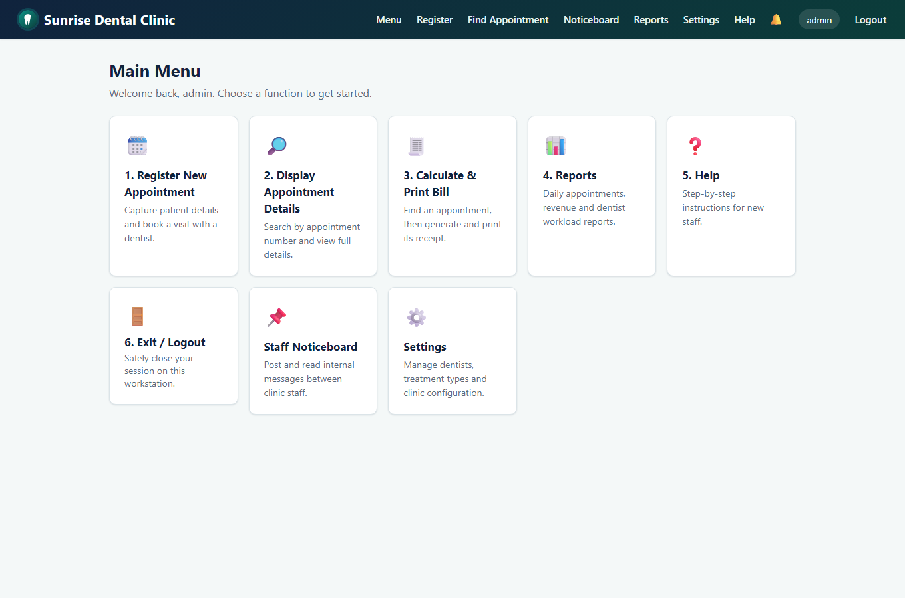
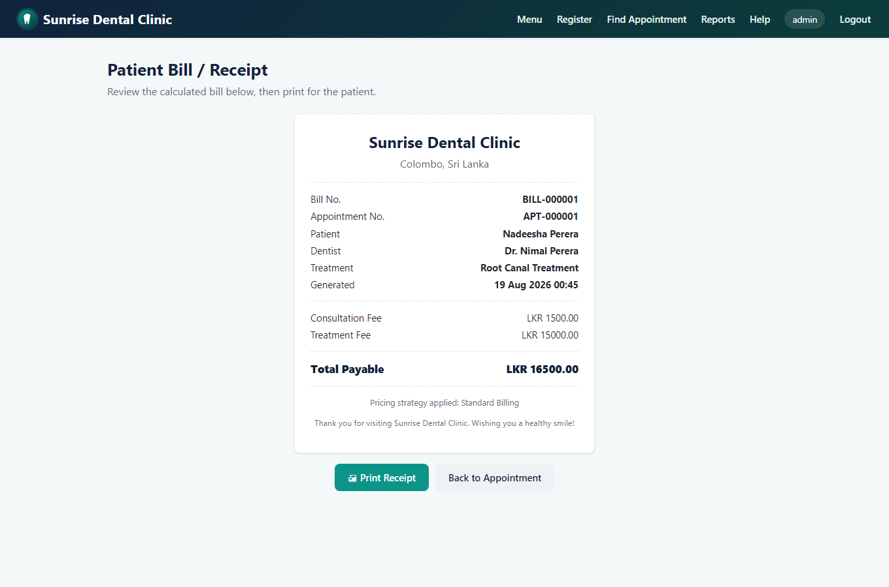

# Sunrise Dental Clinic — Appointment & Patient Management System

[](https://github.com/REPLACE_ME/sunrise-dental-clinic/actions/workflows/ci.yml)

A distributed, three-tier Java web application built for **CIS6003 Advanced Programming**
(Cardiff Metropolitan University), implementing the Sunrise Dental Clinic scenario from the
assessment brief: a computerised replacement for the clinic's paper-based appointment book.

> Built with Java 17, Spring Boot 3, Spring Security, Spring Data JPA, Thymeleaf, and H2.

## Contents

- [Functionality → brief mapping](#functionality--brief-mapping)
- [Architecture](#architecture)
- [Design patterns implemented](#design-patterns-implemented)
- [Running the application](#running-the-application)
- [Demo accounts](#demo-accounts)
- [REST API (web services)](#rest-api-web-services)
- [Testing](#testing)
- [Screenshots](#screenshots)
- [Project structure](#project-structure)

## Functionality → brief mapping

| # | Brief requirement | Implementation |
|---|---|---|
| 1 | User Authentication (Login) | Spring Security form login (session/cookie) for the web UI, HTTP Basic for the REST API. Passwords stored BCrypt-hashed. Two roles: `ADMIN`, `RECEPTIONIST`. |
| 2 | Register New Appointment | `/appointments/new` — validated form, prevents double-booking, auto-generates a unique appointment number. |
| 3 | Display Appointment Details | `/appointments/search` — search by appointment number, shows full patient/visit details. |
| 4 | Calculate and Print Bill | `/appointments/{number}/bill` — prices the visit via a pluggable billing strategy and renders a printable receipt. |
| 5 | Help Section | `/help` — step-by-step guide for new staff. |
| 6 | Exit System | Logout (session invalidated, CSRF-protected POST). |
| *extra* | Reports | `/reports` (admin-only) — Daily Appointments, Revenue, and Dentist Workload reports over a date range. |

**Design assumptions** (per the brief's invitation to make reasonable assumptions):
- Patients are registered **once** and reused across visits (matched by contact number), rather
  than re-entered on every appointment, to avoid duplicate patient records.
- Two staff roles exist (`ADMIN`, `RECEPTIONIST`); only admins can view clinic-wide reports.
- SMS/email notifications on booking are **simulated** (logged + persisted to a `notifications`
  table) since no real gateway credentials are available in this environment — the `Observer`
  pattern used means swapping in a real gateway (Twilio, JavaMail) is a one-class change.
- Returning patients with 3+ completed visits receive a 10% loyalty discount on the treatment fee.

## Architecture

Classic three-tier architecture, cleanly separated by Java package:

```
┌─────────────────────────────────────────────────────────┐
│ Presentation tier                                        │
│  • web/    Thymeleaf MVC controllers (staff-facing UI)   │
│  • api/    REST controllers (JSON web services)          │
├─────────────────────────────────────────────────────────┤
│ Business logic tier                                       │
│  • service/          AppointmentService, BillingService,  │
│                       PatientService, ReportService,       │
│                       ClinicFacade (Facade over the above) │
│  • service/pattern/  Design pattern implementations        │
│  • security/         UserDetailsServiceImpl                │
├─────────────────────────────────────────────────────────┤
│ Data access tier                                           │
│  • domain/       JPA entities                              │
│  • repository/   Spring Data JPA repositories (DAO)        │
│  • H2 (file-based) — swappable for MySQL/Postgres via one   │
│    datasource property, no code changes                    │
└─────────────────────────────────────────────────────────┘
```

The REST API (`/api/**`) and the web UI (everything else) are two independently secured
[Spring Security filter chains](src/main/java/lk/icbt/dentalclinic/config/SecurityConfig.java)
sharing the same service/data layer — the API can be consumed by any external client
(a partner lab system, a future mobile app), which is what makes this a genuinely
**distributed application with web services**, not just a web app with two view types.

## Design patterns implemented

| Pattern | Where | Why |
|---|---|---|
| **Singleton** | [`AppointmentNumberGenerator`](src/main/java/lk/icbt/dentalclinic/service/pattern/AppointmentNumberGenerator.java) | One shared, thread-safe counter guarantees no two appointments ever get the same number, even under concurrent bookings. |
| **Strategy** | [`BillingStrategy`](src/main/java/lk/icbt/dentalclinic/service/pattern/BillingStrategy.java) + `StandardBillingStrategy` + `ReturningPatientDiscountStrategy` | Interchangeable pricing algorithms without `if/else` chains in the billing service; new pricing rules plug in as new classes. |
| **Factory** | [`BillingStrategyFactory`](src/main/java/lk/icbt/dentalclinic/service/pattern/BillingStrategyFactory.java) | Selects the correct billing strategy at runtime based on patient visit history. |
| **Factory Method** | [`ReportFactory`](src/main/java/lk/icbt/dentalclinic/service/pattern/ReportFactory.java) + `Report` interface | Report generation (Daily Appointments / Revenue / Dentist Workload) is requested by type, hiding which concrete report class is built. |
| **Observer** | [`AppointmentEventPublisher`](src/main/java/lk/icbt/dentalclinic/service/pattern/AppointmentEventPublisher.java) + `NotificationObserver` + `AuditLogObserver` | Decouples "an appointment was booked" from "what happens next" (simulated SMS, audit log) — new reactions plug in without touching `AppointmentService`. |
| **Builder** | [`BillBuilder`](src/main/java/lk/icbt/dentalclinic/service/pattern/BillBuilder.java) | Fluent, validated assembly of a `Bill` (derives the bill number, timestamps it) instead of a large telescoping constructor. |
| **Facade** | [`ClinicFacade`](src/main/java/lk/icbt/dentalclinic/service/ClinicFacade.java) | Single simplified entry point over five collaborating services/repositories, keeping the presentation-layer controllers thin. |
| **DAO / Repository** | `repository/*Repository` (Spring Data JPA) | Standard data-access abstraction over the H2 database. |

## Running the application

Requires JDK 17 and Maven (a wrapper is not bundled; use a locally installed Maven 3.9+).

```bash
mvn spring-boot:run
```

The app starts on **http://localhost:8080** (override with `--server.port=NNNN`). On first run,
`DataSeeder` creates demo staff accounts, three dentists, and six treatment types automatically —
no manual setup needed. Data persists in a local H2 file database under `./data/`.

### Demo accounts

| Username | Password | Role |
|---|---|---|
| `admin` | `Admin@123` | ADMIN (full access, including Reports) |
| `reception` | `Reception@123` | RECEPTIONIST (everything except Reports) |

## REST API (web services)

Secured with HTTP Basic, using the same staff accounts as the web UI.

```bash
# Register an appointment
curl -u admin:Admin@123 -X POST http://localhost:8080/api/appointments \
  -H "Content-Type: application/json" \
  -d '{
        "patientName": "Nadeesha Perera",
        "address": "No. 45, Nugegoda, Colombo",
        "contactNumber": "0719876543",
        "dentistId": 1,
        "treatmentTypeId": 4,
        "appointmentDate": "2026-09-01",
        "appointmentTime": "10:30"
      }'

# Look up an appointment
curl -u admin:Admin@123 http://localhost:8080/api/appointments/APT-000001

# Get its bill
curl -u admin:Admin@123 http://localhost:8080/api/appointments/APT-000001/bill

# Run a report
curl -u admin:Admin@123 "http://localhost:8080/api/reports/REVENUE?from=2026-08-01&to=2026-08-31"
```

## Testing

Test-driven development was used for the core billing/numbering logic (see the assignment
report's Task C for the full test plan and TDD narrative). 36 tests across unit
(JUnit 5 + Mockito), MockMvc, and full Spring Boot integration levels:

```bash
mvn test
```

CI (`.github/workflows/ci.yml`) runs the full suite automatically on every push and pull
request against `main`.

## Screenshots

See [`docs/screenshots/`](docs/screenshots) for the full walkthrough (login, validation errors,
double-booking prevention, billing, reports, role-based access control, and the REST API
responding with JSON). A sample:

| Main Menu | Bill / Receipt |
|---|---|
|  |  |

## Project structure

```
src/main/java/lk/icbt/dentalclinic/
├── domain/            JPA entities
├── repository/         Spring Data JPA repositories
├── service/            Business logic + ClinicFacade
├── service/pattern/     Design pattern implementations
├── security/            Spring Security UserDetailsService
├── config/              Security config, data seeder
├── web/                 Thymeleaf MVC controllers
├── api/                 REST controllers + error handling
├── dto/                 Request/response DTOs
└── exception/           Domain exceptions

src/main/resources/
├── templates/           Thymeleaf views
├── static/css, static/img   Themed stylesheet, logo/favicon
└── application.yml

docs/
├── diagrams/             UML diagrams (use case, class, 3× sequence)
├── screenshots/          Application walkthrough screenshots
└── *.js                  One-off scripts used to generate the above
```

---

*Module: CIS6003 Advanced Programming — Semester 1, 2024/25 — Cardiff Metropolitan University
(delivered via ICBT Campus). See the accompanying assessment report for UML design rationale,
the full test plan, and the Git/GitHub workflow write-up (Tasks A–D).*
